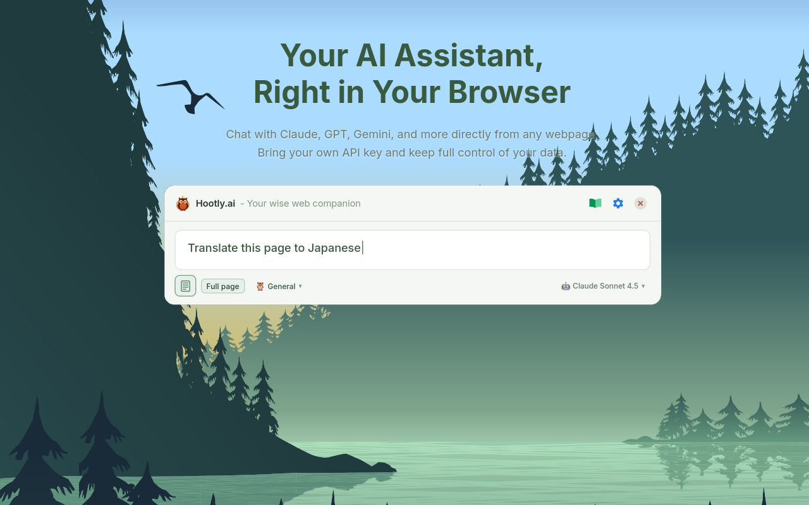

# Hootly.ai



AI assistant for any webpage. Bring your own API key from Claude, OpenAI, Gemini, or OpenRouter. Free, private, no middleman.

## Prerequisites

- Node.js 18+

## Quick Start

```bash
npm install
npm run build
```

**Firefox**: `about:debugging#/runtime/this-firefox` → Load Temporary Add-on → select `dist/firefox/manifest.json`

**Chrome**: `chrome://extensions` → Enable Developer mode → Load unpacked → select `dist/chrome/`

## Setup

1. Click toolbar icon → Settings
2. Enter API key (Claude, OpenAI, Gemini, or OpenRouter)
3. Select model
4. Press `Alt+C` on any webpage to chat

## Features

- **Multiple providers**: Claude, OpenAI, Gemini, OpenRouter
- **Context modes**: Text selection or full page
- **Personas**: Pre-built and custom AI personalities
- **History**: View and continue past conversations
- **Dark mode**: Auto, light, or dark theme
- **10 languages**: EN, NL, DE, FR, ES, IT, PT, ZH, JA, KO
- **Keyboard shortcuts**: `Alt+C` (toggle), `Esc` (close/stop)
- **Draggable/resizable** dialog with saved position
- **Privacy-focused**: On-demand injection, minimal permissions

## Commands

| Command | Description |
|---------|-------------|
| `npm run build` | Build for Firefox and Chrome |
| `npm run build:firefox` | Build Firefox only |
| `npm run build:chrome` | Build Chrome only |
| `npm test` | Run tests |
| `npm run release` | Create release zips |

## Project Structure

```
src/
├── background/       # Service worker (API calls, on-demand injection)
├── content/          # Content script + React dialog
├── settings/         # Settings page
├── personas/         # Personas management page
├── history/          # History page
├── chat/             # Standalone chat page
└── shared/           # Utils, storage, i18n, models
```

## Tech Stack

React, TypeScript, Vite, Emotion CSS, Vitest

## Release Process

1. Make necessary code changes and commit
2. Bump version in package.json
3. Git commit, tag + push
4. Run `npm run release` to build zip-files for upload to addon-stores
5. For source-code upload, create a release zip on https://github.com/filidorwiese/hootly.ai/releases

### Firefox Addons
Submit a new version on https://addons.mozilla.org/nl/developers/addons

### Chrome Web Store
Submit a new version on https://chrome.google.com/webstore/devconsole/


## Links

- [Report issues](https://github.com/filidorwiese/hootly.ai/issues)
- [Development guidelines](CLAUDE.md)
- [Privacy policy & License](PRIVACY.md)

